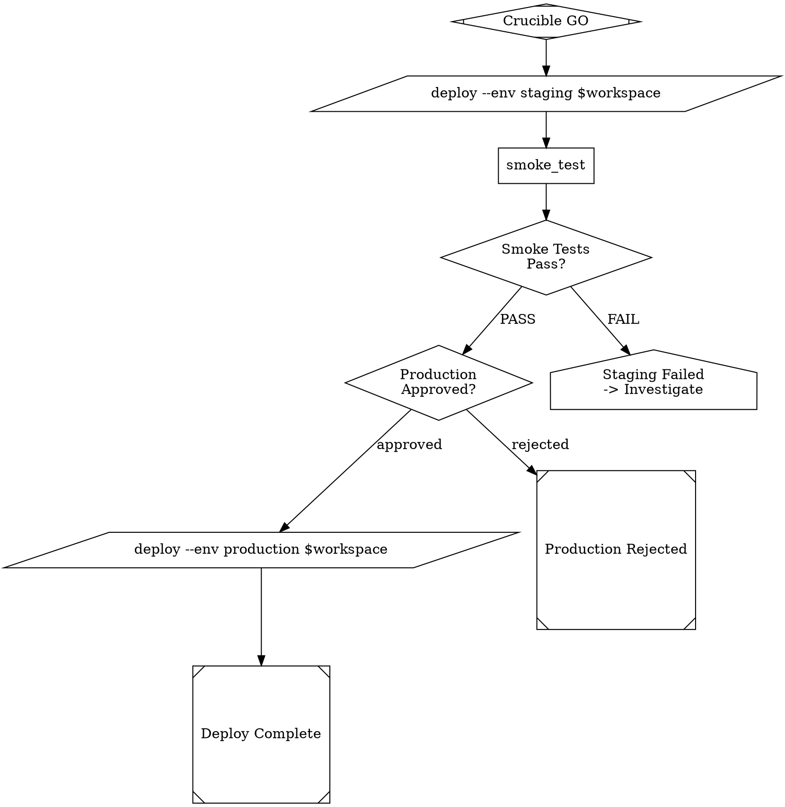

# Custom Pipelines

Dark Factory uses DOT (Graphviz) files to define pipeline workflows. Each
pipeline describes a directed graph of stages — agent prompts, tool
invocations, decision diamonds, and human escalation points.

You can override any built-in pipeline or create entirely new ones.

## Built-in Pipelines

The following pipelines ship with Dark Factory in `factory/pipelines/`:

| Pipeline | File | Purpose |
|---|---|---|
| Dark Forge | `dark_forge.dot` | TDD build engine — architecture review, spec generation, test-writer/feature-writer loop |
| Sentinel | `sentinel.dot` | Security gates (secret scan, SAST, dep audit, image scan, AI review) |
| Crucible | `crucible.dot` | Test validation — run suite, classify failures, produce GO/NO_GO/NEEDS_LIVE verdict |
| Deploy | `deploy.dot` | Deployment template (empty by default — customize for your workflow) |
| Ouroboros | `ouroboros.dot` | Self-improvement loop |
| Arch Review (Web) | `arch_review_web.dot` | Architecture review for web-strategy projects |
| Arch Review (Console) | `arch_review_console.dot` | Architecture review for console-strategy projects |

## User Custom Pipelines Directory

Place custom DOT files in the `.dark-factory/pipelines/` directory at your
project root:

```
your-project/
├── .dark-factory/
│   ├── config.json
│   └── pipelines/          # <-- your custom pipelines go here
│       ├── deploy.dot       # overrides the built-in deploy pipeline
│       └── my_pipeline.dot  # a brand-new pipeline
├── src/
└── ...
```

Create the directory if it doesn't exist:

```bash
mkdir -p .dark-factory/pipelines
```

Any `.dot` file placed here is automatically discovered. The pipeline name
is derived from the file stem (e.g., `my_pipeline.dot` → pipeline name
`my_pipeline`).

## Config Overrides: `pipeline.overrides`

For maximum flexibility, you can point a pipeline name to any DOT file on
disk — even outside your project — via the `pipeline.overrides` key in
`.dark-factory/config.json`:

```json
{
  "pipeline": {
    "overrides": {
      "deploy": "special/my_deploy.dot",
      "custom_ci": "/absolute/path/to/custom_ci.dot"
    }
  }
}
```

- **Relative paths** are resolved from the project root.
- **Absolute paths** are used as-is.
- If the referenced file does not exist, the override is silently skipped
  and a warning is logged.

## Pipeline Discovery Order

When Dark Factory resolves a pipeline by name, it searches three locations.
**Later sources override earlier ones** (last wins):

1. **Built-in** — `factory/pipelines/*.dot` (shipped with Dark Factory)
2. **User custom** — `.dark-factory/pipelines/*.dot` (project-local overrides)
3. **Config overrides** — `pipeline.overrides` in `.dark-factory/config.json`
   (explicit name → path mapping, highest priority)

For example, if both `factory/pipelines/deploy.dot` and
`.dark-factory/pipelines/deploy.dot` exist, the user custom version wins.
If `pipeline.overrides` also maps `"deploy"` to another file, that config
override wins over both.

This layering lets you:

- **Add** new pipelines by dropping a `.dot` file in `.dark-factory/pipelines/`.
- **Replace** a built-in pipeline by creating a file with the same stem name.
- **Pin** a pipeline to a specific path via config overrides.

## Writing a Custom Pipeline DOT File

A pipeline DOT file is a standard Graphviz `digraph` with Dark Factory
conventions for node shapes and attributes.

### Node Shapes

| Shape | Meaning | Example |
|---|---|---|
| `Mdiamond` | Entry point | `start [shape=Mdiamond, label="Issue Ready"]` |
| `Msquare` | Terminal / output | `done [shape=Msquare, label="Complete"]` |
| `box` | Agent stage (has a `prompt`) | `writer [shape=box, prompt="..."]` |
| `parallelogram` | Tool / command execution | `run_tests [shape=parallelogram, label="pytest"]` |
| `diamond` | Decision point | `check [shape=diamond, label="Pass?"]` |
| `house` | Human escalation | `escalate [shape=house, label="Needs Human"]` |
| `hexagon` | Loop / iterator | `loop [shape=hexagon, max_iterations=5]` |
| `component` | Sub-pipeline invocation | `review [shape=component, pipeline="other.dot"]` |

### Graph Attributes

Set the pipeline goal on the `graph` node:

```dot
digraph my_pipeline {
    graph [goal="Short description of what this pipeline accomplishes"]
    ...
}
```

### Example: Custom Deploy Pipeline

Below is a complete custom pipeline that adds staging, smoke tests, and a
production approval gate to the default (empty) deploy template:



Save this as `.dark-factory/pipelines/deploy.dot` to override the built-in
empty deploy template.

### Tips

- Every pipeline must have at least a `start` node (entry) and one terminal
  node.
- Agent stages (`shape=box`) use the `prompt` attribute to define the agent's
  instructions. Use `$variable` syntax for runtime context injection.
- Decision nodes (`shape=diamond`) route flow via edge labels.
- Use `shape=component` with a `pipeline` attribute to invoke another pipeline
  as a sub-pipeline (see `dark_forge.dot` for an example with
  `arch_review_${strategy}.dot`).
- Keep prompts focused — each agent stage should have a single clear
  responsibility.

## Programmatic Access

The pipeline loader is available as a Python API:

```python
from factory.pipeline.loader import discover_pipelines

# Discover all available pipelines (built-in + user + config overrides)
pipelines = discover_pipelines(project_root=Path("/path/to/project"))

# Returns: {"dark_forge": Path("..."), "deploy": Path("..."), ...}
```

To run a discovered pipeline:

```python
from factory.pipeline.engine import FactoryPipelineEngine

engine = FactoryPipelineEngine()
result = await engine.run_pipeline("deploy", {"workspace": "/path/to/ws"})
```
